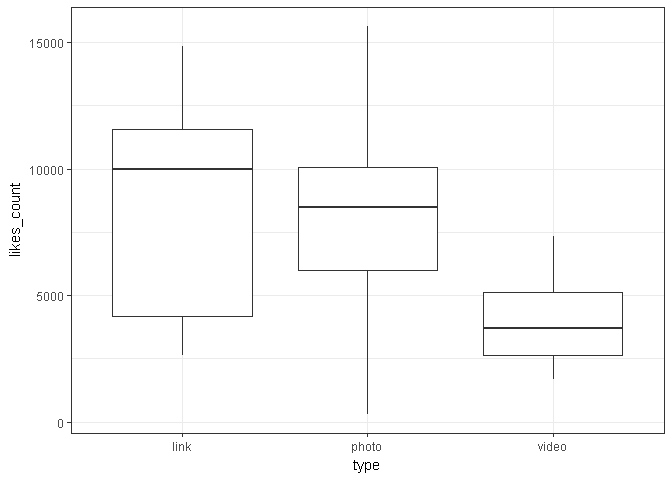

勵志書暢銷的背後，吸引讀者的詞彙為何？
================

### 胡茹芳

分析議題背景
------------

在這出版業人人喊苦,書店一間接著一間熄燈 勵志書籍能和工具書並駕齊驅甚至高居排行榜不下 Peter Su 是近年暢銷書的作家,在百花齊放的社群上有著高人氣 出版的著作有著驚人的銷量 在這出版業哀聲載道,一刷2000本能賣完是萬幸的寒冬 還能賣出十萬本的書籍究竟是深藏著何種功夫 在暢銷的背後，讀者追尋的是什麼？

分析動機
--------

<http://www.openbook.org.tw/article/20170225-249> 看到這篇文章覺得很有意思,也想到今年於台北國際書展 勵志書籍的數量相當驚人,也放在各出版社的醒目位置 走過去總會忍不住拿起來翻個幾頁或是將封面書腰上的文字快速閱讀過 網路上對於此類的書籍評價正反兩極 (正方認為能夠帶來舒緩;反方持無病呻吟的看法) Peter Su 是先由FB貼文引起關注而逐漸擁有許多粉絲,才得以出書 能夠在短短一個月55刷衝破10本的銷量 不論內容是什麼,總是讓我很好奇

使用資料
--------

打算抓暢銷作家PeterSu在FB的貼文 時間是2017四月至今

載入使用資料們

``` r
token<- "EAACEdEose0cBAPLJYblqnv7O5Qyr1tAAaYLH7pZCyqZB8LZCsIuOYqI9Y94G3f3a3L1h4DRliaOpz22KZByUhNZCyvnSQXIXgY3tq6AFaHGoWio9dcZA8hMqNsLhdvVobDDVcKuRnhiEeilXzB3we9XKvEHJ3ibYt56xvJfxAsNpZByqHUzV7gpJV6gqw95RPsZD" #access token 
#install.packages("Rfacebook")  #初次使用須先安裝
library(Rfacebook) 
```

    ## Loading required package: httr

    ## Warning: package 'httr' was built under R version 3.3.3

    ## Loading required package: rjson

    ## Loading required package: httpuv

    ## Warning: package 'httpuv' was built under R version 3.3.3

    ## 
    ## Attaching package: 'Rfacebook'

    ## The following object is masked from 'package:methods':
    ## 
    ##     getGroup

``` r
lastDate<-Sys.Date()
DateVector<-seq(as.Date("2017-04-01"),lastDate,by="1 days")  #目前以4月至今的貼文來做初步的分析
DateVectorStr<-as.character(DateVector)
totalPage<-NULL
for(i in 1:(length(DateVectorStr)-1)){
    tempPage<-getPage("petesonline", token,
                since = DateVectorStr[i],
                until = DateVectorStr[i+1])
    totalPage<-rbind(totalPage,tempPage)
}
```

    ## 0 posts

    ## No public posts were found : petesonline

    ## 1 posts 0 posts

    ## No public posts were found : petesonline

    ## 1 posts 1 posts 0 posts

    ## No public posts were found : petesonline

    ## 1 posts 1 posts 1 posts 2 posts 2 posts 2 posts 1 posts 1 posts 0 posts

    ## No public posts were found : petesonline

    ## 0 posts

    ## No public posts were found : petesonline

    ## 1 posts 1 posts 0 posts

    ## No public posts were found : petesonline

    ## 0 posts

    ## No public posts were found : petesonline

    ## 0 posts

    ## No public posts were found : petesonline

    ## 1 posts 2 posts 1 posts 1 posts 1 posts 1 posts 2 posts 0 posts

    ## No public posts were found : petesonline

    ## 1 posts 1 posts 1 posts 0 posts

    ## No public posts were found : petesonline

    ## 1 posts 1 posts 1 posts 1 posts 0 posts

    ## No public posts were found : petesonline

    ## 0 posts

    ## No public posts were found : petesonline

    ## 1 posts 1 posts 1 posts 0 posts

    ## No public posts were found : petesonline

    ## 1 posts 0 posts

    ## No public posts were found : petesonline

    ## 0 posts

    ## No public posts were found : petesonline

    ## 1 posts 1 posts 1 posts 0 posts

    ## No public posts were found : petesonline

    ## 0 posts

    ## No public posts were found : petesonline

    ## 1 posts 1 posts 1 posts 1 posts 0 posts

    ## No public posts were found : petesonline

    ## 1 posts 0 posts

    ## No public posts were found : petesonline

    ## 0 posts

    ## No public posts were found : petesonline

``` r
nrow(totalPage) #得知有幾筆資料
```

    ## [1] 44

資料處理與清洗
--------------

將totalPage裡的id,from\_id,from\_name的欄位拿掉

處理資料

``` r
totalPage$id <- NULL
totalPage$from_id <- NULL
totalPage$from_name <- NULL
totalPage$link <- NULL
str(totalPage)
```

    ## 'data.frame':    44 obs. of  7 variables:
    ##  $ message       : chr  "真正的放下或許是這樣吧，有一天突然可以大方地看見他發的狀態，路上遇見也可以輕鬆的點個頭，朋友間聽到他的消息，大概也可以不痛不癢"| __truncated__ "一輩子真的很短，好像一眨眼就沒了，所以我想和你一起去看看這世界，\n\n至少在最後可以不留遺憾的說：我們一起來過，與青春有關的日子"| __truncated__ "我們光是去喜歡自己喜歡的人和事就得用盡一生的力氣了，哪有時間去管不喜歡你的人到底喜不喜歡你阿，這一路上你花了多少時間去討厭自己"| __truncated__ "其實很多事情還能說的出口，還能發個狀態的，大部份都是可以接受也比較容易放下的，放在心底那段沒說的才是讓人無法觸碰的。\n\n那些事"| __truncated__ ...
    ##  $ created_time  : chr  "2017-04-02T14:07:09+0000" "2017-04-04T13:49:32+0000" "2017-04-05T13:55:45+0000" "2017-04-07T13:50:16+0000" ...
    ##  $ type          : chr  "photo" "photo" "photo" "photo" ...
    ##  $ story         : chr  NA NA NA NA ...
    ##  $ likes_count   : num  11521 15633 8675 9817 8151 ...
    ##  $ comments_count: num  93 113 70 48 44 40 36 29 13 31 ...
    ##  $ shares_count  : num  535 598 394 575 212 266 350 4 145 40 ...

探索式資料分析
--------------

透過結巴來進行中文斷詞,看什麼詞彙是作者頻繁使用 來得知內容多半會涉及哪方面 利用group\_by 來分析發文附上影片,圖片,連結之間是否會有差距懸殊的互動 (在此假設互動就是有在貼文進行留言,按讚,或分享)

``` r
#install.packages("jiebaR")
library(jiebaR)
```

    ## Warning: package 'jiebaR' was built under R version 3.3.3

    ## Loading required package: jiebaRD

    ## Warning: package 'jiebaRD' was built under R version 3.3.3

``` r
cutter <- worker()
cutter$bylines<- TRUE ## 分行輸出
cutter[totalPage$message] 
```

    ## [[1]]
    ##  [1] "真正"      "的"        "放下"      "或許"      "是"       
    ##  [6] "這樣"      "吧"        "有"        "一天"      "突然"     
    ## [11] "可以"      "大方"      "地"        "看見"      "他發"     
    ## [16] "的"        "狀態"      "路上"      "遇見"      "也"       
    ## [21] "可以"      "輕鬆"      "的點"      "個頭"      "朋友"     
    ## [26] "間"        "聽到"      "他"        "的"        "消息"     
    ## [31] "大概"      "也"        "可以"      "不痛不癢"  "的"       
    ## [36] "聽"        "著"        "吧"        "一直"      "到"       
    ## [41] "後來"      "才"        "懂得"      "原來"      "放下"     
    ## [46] "比"        "堅持"      "還"        "強大"      "如果"     
    ## [51] "可以"      "簡單"      "誰"        "想要"      "複雜"     
    ## [56] "城邦"      "讀書"      "花園"      "http"      "goo"      
    ## [61] "gl"        "3"         "QqJJY"     "博客"      "來"       
    ## [66] "http"      "goo"       "gl"        "Z7VbhP"    "Instagram"
    ## [71] "peter825"  "微博"      "Peter"     "Su"       
    ## 
    ## [[2]]
    ##  [1] "一輩子"    "真的"      "很"        "短"        "好像"     
    ##  [6] "一眨眼"    "就"        "沒"        "了"        "所以"     
    ## [11] "我"        "想"        "和"        "你"        "一起"     
    ## [16] "去"        "看看"      "這"        "世界"      "至少"     
    ## [21] "在"        "最後"      "可以"      "不留"      "遺憾"     
    ## [26] "的說"      "我們"      "一"        "起來"      "過"       
    ## [31] "與"        "青春"      "有關"      "的"        "日子"     
    ## [36] "Instagram" "peter825" 
    ## 
    ## [[3]]
    ##  [1] "我們"            "光是"            "去"             
    ##  [4] "喜歡"            "自己"            "喜歡"           
    ##  [7] "的"              "人和事"          "就"             
    ## [10] "得"              "用盡"            "一生"           
    ## [13] "的"              "力氣"            "了"             
    ## [16] "哪有"            "時間"            "去"             
    ## [19] "管"              "不"              "喜歡"           
    ## [22] "你"              "的"              "人"             
    ## [25] "到底"            "喜不喜歡"        "你"             
    ## [28] "阿"              "這"              "一路上"         
    ## [31] "你"              "花"              "了"             
    ## [34] "多少"            "時間"            "去"             
    ## [37] "討厭"            "自己"            "討厭"           
    ## [40] "的"              "人"              "就"             
    ## [43] "少"              "了"              "多少"           
    ## [46] "時間"            "去"              "喜歡"           
    ## [49] "自己"            "喜歡"            "的"             
    ## [52] "人"              "做"              "自己"           
    ## [55] "喜歡"            "的"              "事"             
    ## [58] "adidasOriginals" "NMD"             "XR1"            
    ## [61] "全黑"            "的"              "鞋子"           
    ## [64] "超"              "誘人"            "<ed><U+00A0><U+00BD>"
    ## [67] "<ed><U+00B8><U+008D>" "Instagram"       "peter825"       
    ## [70] "微博"            "Peter"           "Su"             
    ## 
    ## [[4]]
    ##  [1] "其實"      "很多"      "事情"      "還能"      "說"       
    ##  [6] "的"        "出口"      "還能"      "發個"      "狀態"     
    ## [11] "的"        "大部份"    "都"        "是"        "可以"     
    ## [16] "接受"      "也"        "比較"      "容易"      "放下"     
    ## [21] "的"        "放在"      "心底"      "那段"      "沒說的"   
    ## [26] "才"        "是"        "讓"        "人"        "無法"     
    ## [31] "觸碰"      "的"        "那些"      "事"        "放在"     
    ## [36] "心底"      "並"        "不是"      "要"        "去"       
    ## [41] "刻意"      "對"        "誰"        "隱瞞"      "只是"     
    ## [46] "有些"      "人"        "和"        "故事"      "不是"     
    ## [51] "三言兩語"  "可以"      "說"        "清"        "的"       
    ## [56] "Instagram" "peter825"  "微博"      "Peter"     "Su"       
    ## 
    ## [[5]]
    ##  [1] "頻率"        "相同"        "的"          "人"          "是"         
    ##  [6] "不用"        "刻意"        "靠近"        "的"          "今日"       
    ## [11] "拍攝"        "MO"          "Love"        "Wins"        "手環"       
    ## [16] "收工"        "照"          "<ed><U+00A0><U+00BC>" "<ed><U+00BC><U+0088>" "Instagram"  
    ## [21] "peter825"    "Weibo"       "PeterSu"    
    ## 
    ## [[6]]
    ##  [1] "那些"      "風光明媚"  "的"        "日子"      "是"       
    ##  [6] "你給"      "的"        "只是"      "沒想到"    "後來"     
    ## [11] "這些"      "大風大浪"  "也"        "是"        "你"       
    ## [16] "起"        "的"        "今天天氣"  "很"        "好"       
    ## [21] "但"        "也"        "和"        "你"        "沒"       
    ## [26] "了"        "關係"      "Instagram" "peter825"  "微博"     
    ## [31] "PeterSu"  
    ## 
    ## [[7]]
    ##  [1] "我們"      "都"        "有"        "一段"      "故作"     
    ##  [6] "堅強"      "的"        "時候"      "可"        "我們"     
    ## [11] "又"        "不是"      "電影"      "裡"        "不用"     
    ## [16] "吃飯"      "也"        "不會"      "死掉"      "的"       
    ## [21] "英雄"      "不用"      "逞強"      "了"        "偶爾"     
    ## [26] "難過"      "是"        "沒關係"    "的"        "Instagram"
    ## [31] "peter825"  "微博"      "PeterSu"  
    ## 
    ## [[8]]
    ##  [1] "哈囉"        "澎湖"        "夏天"        "的"          "季節"       
    ##  [6] "已經"        "開始"        "了"          "聽說"        "本島"       
    ## [11] "很熱"        "<ed><U+00A0><U+00BC>" "<ed><U+00BC><U+009E>" "<ed><U+00A0><U+00BD>" "<ed><U+00B4><U+00A5>"
    ## [16] "<ed><U+00A0><U+00BC>" "<ed><U+00BF><U+009D>" "<U+FE0F>"    "長"          "這麼"       
    ## [21] "大"          "第一次"      "來"          "澎湖"        "澎湖"       
    ## [26] "真的"        "很美"        "啊"          "海鮮"        "天堂"       
    ## 
    ## [[9]]
    ##  [1] "願"          "未來"        "的"          "我們"        "都"         
    ##  [6] "能"          "感謝"        "現在"        "拼了命"      "努力"       
    ## [11] "的"          "自己"        "無論"        "結果"        "好壞"       
    ## [16] "至少"        "我們"        "沒白來過"    "這"          "一生"       
    ## [21] "謝謝"        "MO"          "lovewins"    "的"          "手環"       
    ## [26] "真的"        "很美"        "<ed><U+00A0><U+00BD>" "<ed><U+00B8><U+008D>" "Instagram"  
    ## [31] "peter825"   
    ## 
    ## [[10]]
    ##  [1] "人生"        "就是"        "要"          "像"          "個"         
    ##  [6] "孩子"        "般的"        "往前"        "衝"          "在"         
    ## [11] "華麗"        "的"          "跌倒"        "<ed><U+00A0><U+00BD>" "<ed><U+00B8><U+0082>"
    ## [16] "petersu"     "澎湖"        "penghu"      "Instagram"   "peter825"   
    ## 
    ## [[11]]
    ##  [1] "喜歡"      "你"        "的"        "人"        "即使"     
    ##  [6] "你"        "說錯"      "了"        "話"        "也"       
    ## [11] "會"        "願意"      "原諒"      "討厭"      "你"       
    ## [16] "的"        "人"        "你"        "說"        "得"       
    ## [21] "再"        "小心翼翼"  "也"        "會"        "感到"     
    ## [26] "厭煩"      "所以"      "你別"      "想"        "得"       
    ## [31] "太"        "多"        "很多"      "時候"      "不是"     
    ## [36] "你"        "做"        "得"        "不夠"      "好"       
    ## [41] "只是"      "對方"      "剛好"      "沒有"      "喜歡"     
    ## [46] "你"        "而已"      "如果"      "不是"      "相互"     
    ## [51] "喜歡"      "你"        "的"        "執著"      "在"       
    ## [56] "他"        "的"        "世界"      "也"        "只能"     
    ## [61] "算是"      "種"        "糾纏"      "Instagram" "peter825" 
    ## 
    ## [[12]]
    ##  [1] "MO"   "的"   "快"   "閃店" "還有" "少量" "的"   "聯名" "手環" "呀"  
    ## [11] "有空" "的"   "朋友" "可以" "去"   "武昌" "誠品" "4"    "F"    "逛逛"
    ## [21] "晃晃" "看看" "3"   
    ## 
    ## [[13]]
    ##  [1] "一早"   "出海"   "採了"   "滿滿的" "牡蠣"   "澎湖"   "牡蠣"  
    ##  [8] "真的"   "很猛"   "<ed><U+00A0><U+00BD>" "<ed><U+00B2><U+00AA>" "<ed><U+00A0><U+00BC>" "<ed><U+00BF><U+00BB>" "感謝"  
    ## [15] "The"    "North"  "Face"   "Taiwan" "讓"     "我"     "防風"  
    ## [22] "防水"   "還"     "防曬"  
    ## 
    ## [[14]]
    ##  [1] "那"        "一年"      "有些"      "告白"      "說不出口" 
    ##  [6] "一直"      "到"        "你"        "轉身"      "以後"     
    ## [11] "Instagram" "peter825" 
    ## 
    ## [[15]]
    ##  [1] "一個"      "很會"      "胡思亂想"  "另"        "一個"     
    ##  [6] "不"        "喜歡"      "解釋"      "我"        "想"       
    ## [11] "這"        "大概"      "也"        "是"        "很多"     
    ## [16] "人"        "分開"      "的"        "原因"      "之一"     
    ## [21] "吧"        "沒有"      "誰"        "對"        "誰錯"     
    ## [26] "只是"      "角度"      "和"        "立場"      "不同"     
    ## [31] "罷了"      "Instagram" "peter825" 
    ## 
    ## [[16]]
    ##  [1] "最"        "幸福"      "的"        "狀態"      "是"       
    ##  [6] "即使"      "我們"      "沒有"      "聯繫"      "感情"     
    ## [11] "依舊"      "在"        "那裡"      "不"        "一定"     
    ## [16] "有聊"      "不"        "完"        "的"        "天"       
    ## [21] "和"        "說不完"    "的"        "秘密"      "靜靜的"   
    ## [26] "陪伴"      "就是"      "我們"      "之間"      "友誼"     
    ## [31] "最"        "美好"      "的"        "模樣"      "啊"       
    ## [36] "謝謝"      "Uniqlo"    "Taiwan"    "的"        "陪伴"     
    ## [41] "Instagram" "peter825" 
    ## 
    ## [[17]]
    ##  [1] "陪伴"      "是"        "一種"      "安靜"      "的"       
    ##  [6] "力量"      "就"        "像"        "每次"      "你"       
    ## [11] "在"        "我"        "最"        "黑暗"      "的"       
    ## [16] "時刻"      "裡陪"      "著"        "我"        "望"       
    ## [21] "到"        "天亮"      "只想"      "說聲"      "很"       
    ## [26] "開心"      "這"        "一生"      "你"        "來"       
    ## [31] "了"        "Instagram" "peter825" 
    ## 
    ## [[18]]
    ##  [1] "一段"      "關係"      "到"        "了"        "最後"     
    ##  [6] "曾經"      "想"        "說"        "的話"      "也"       
    ## [11] "都"        "不再"      "爭執"      "了"        "你"       
    ## [16] "知道"      "很多"      "事情"      "到"        "最後"     
    ## [21] "說"        "了"        "其實"      "也"        "沒太大"   
    ## [26] "的"        "意義"      "喜歡"      "回憶"      "過往"     
    ## [31] "並不"      "代表"      "一定"      "很想"      "回到"     
    ## [36] "過去"      "就"        "像"        "我"        "還是"     
    ## [41] "會"        "想念"      "你"        "只是"      "你"       
    ## [46] "也"        "成為"      "了"        "過去"      "instagram"
    ## [51] "peter825" 
    ## 
    ## [[19]]
    ##  [1] "出外"   "久"     "了"     "心裡"   "剩下"   "全是"   "對"    
    ##  [8] "家人"   "滿滿的" "想念"   "我"     "也"     "想"     "不顧"  
    ## [15] "那些"   "可是"   "所以"   "和"     "你"     "一起"   "坐著望"
    ## [22] "向"     "外頭"   "說"     "說"     "今天"   "發生"   "的"    
    ## [29] "瑣事"   "想"     "趕快"   "回家"   "抱抱"   "你們"   "啦"    
    ## 
    ## [[20]]
    ##  [1] "你問"         "我"           "喜歡"         "一個"        
    ##  [5] "人"           "的"           "感覺"         "是"          
    ##  [9] "什麼"         "我"           "想"           "大概"        
    ## [13] "就"           "像"           "每次"         "去"          
    ## [17] "了"           "趟"           "美得"         "不行"        
    ## [21] "的"           "旅行"         "想著"         "的"          
    ## [25] "都"           "是"           "下次"         "一定"        
    ## [29] "要"           "和"           "你"           "一"          
    ## [33] "起來"         "一次"         "台"           "東都"        
    ## [37] "歷"           "美麗"         "的"           "秘密"        
    ## [41] "海灘"         "讓"           "人"           "不想"        
    ## [45] "離開"         "出發"         "台灣"         "旅行"        
    ## [49] "<ed><U+00A0><U+00BD>" "<ed><U+00B1><U+0089>" "<ed><U+00A0><U+00BC>" "<ed><U+00BF><U+00BB>"
    ## [53] "http"         "www"          "creativetour" "com"         
    ## [57] "tw"           "Instagram"    "peter825"    
    ## 
    ## [[21]]
    ##   [1] "或許"      "多數"      "人"        "都"        "希望"     
    ##   [6] "能"        "保持"      "著"        "正面"      "的"       
    ##  [11] "能量"      "帶著"      "這股"      "力量"      "活著"     
    ##  [16] "只是"      "這個"      "世界"      "的"        "存在"     
    ##  [21] "不是"      "只有"      "它"        "就"        "像"       
    ##  [26] "這"        "世界"      "不會"      "只有"      "白天"     
    ##  [31] "而"        "沒有"      "黑夜"      "的"        "存在"     
    ##  [36] "不會"      "只有"      "快樂"      "而"        "沒有"     
    ##  [41] "悲傷"      "不會"      "只有"      "陪伴"      "而"       
    ##  [46] "沒有"      "離開"      "因為"      "認清"      "了"       
    ##  [51] "這"        "一點"      "所以"      "你"        "知道"     
    ##  [56] "沒有"      "人能"      "永遠"      "活在"      "正面"     
    ##  [61] "能量"      "裡"        "但"        "你"        "必須"     
    ##  [66] "知道"      "面對"      "這"        "世界"      "給你"     
    ##  [71] "的"        "巴掌"      "最好"      "的"        "方式"     
    ##  [76] "就是"      "勇敢"      "面對"      "它"        "並把"     
    ##  [81] "它"        "幹掉"      "台東"      "比西"      "里岸"     
    ##  [86] "隱藏"      "在"        "村落"      "間"        "的"       
    ##  [91] "幾米"      "繪畫"      "會"        "讓"        "人"       
    ##  [96] "想"        "收集"      "完畢"      "Instagram" "peter825" 
    ## 
    ## [[22]]
    ##  [1] "這"           "世界"         "有"           "很多"        
    ##  [5] "人"           "有"           "喜歡"         "你"          
    ##  [9] "的"           "也"           "有"           "討厭"        
    ## [13] "你"           "的"           "就"           "像"          
    ## [17] "海浪"         "一樣"         "有"           "漲潮"        
    ## [21] "也"           "有"           "退潮"         "無論"        
    ## [25] "眼前"         "的"           "變化"         "唯獨"        
    ## [29] "最"           "理解"         "你"           "的"          
    ## [33] "那"           "一位"         "一直"         "靜靜的"      
    ## [37] "待"           "在"           "那"           "未"          
    ## [41] "離開"         "過"           "致"           "我"          
    ## [45] "親愛"         "的"           "朋友"         "台"          
    ## [49] "東海"         "濱"           "公園"         "每次"        
    ## [53] "回家"         "都"           "會來"         "這"          
    ## [57] "走走"         "鄉愁"         "中"           "出發"        
    ## [61] "台灣"         "旅行"         "<ed><U+00A0><U+00BD>" "<ed><U+00B1><U+0089>"
    ## [65] "<ed><U+00A0><U+00BC>" "<ed><U+00BF><U+00BB>" "http"         "www"         
    ## [69] "creativetour" "com"          "tw"           "Instagram"   
    ## [73] "peter825"    
    ## 
    ## [[23]]
    ##  [1] "永遠"      "都"        "不要"      "把"        "想要"     
    ##  [6] "做"        "的"        "事情"      "放在"      "下次"     
    ## [11] "因為"      "下次"      "是"        "沒有"      "期限"     
    ## [16] "的"        "久違"      "的"        "一個"      "人"       
    ## [21] "旅行"      "準備"      "出發"      "台"        "東加"     
    ## [26] "母子"      "灣"        "東海岸"    "線"        "的"       
    ## [31] "一抹"      "微笑"      "去過"      "了"        "會"       
    ## [36] "想念"      "Instagram" "peter825" 
    ## 
    ## [[24]]
    ##  [1] "願"        "你"        "一直"      "保持"      "最"       
    ##  [6] "真實"      "的"        "自己"      "遇見"      "了"       
    ## [11] "看見"      "你"        "真實"      "面貌"      "而"       
    ## [16] "喜歡"      "上"        "你"        "的"        "人"       
    ## [21] "生命"      "中"        "最"        "美好"      "的"       
    ## [26] "一件"      "事"        "也"        "莫過如此"  "台東"     
    ## [31] "都蘭"      "新東"      "糖廠"      "東海岸"    "值"       
    ## [36] "得來"      "走走"      "的"        "地方"      "小時候"   
    ## [41] "的"        "回憶"      "Instagram" "peter825" 
    ## 
    ## [[25]]
    ##  [1] "還"     "來不及" "認識"   "你"     "但"     "我"     "知道"  
    ##  [8] "這"     "世界"   "因為"   "你"     "而"     "更好"   "了"    
    ## [15] "一些"   "R"      "I"      "P"      "<ed><U+00A0><U+00BD>" "<ed><U+00B8><U+00A2>"
    ## 
    ## [[26]]
    ##   [1] "如果"     "累"       "了"       "就"       "去"       "看看"    
    ##   [7] "海"       "吧"       "總有"     "一些"     "煩惱"     "會"      
    ##  [13] "隨著"     "一望無際" "的"       "海平線"   "淡去"     "這是"    
    ##  [19] "我"       "在"       "旅行"     "途中"     "最愛"     "做"      
    ##  [25] "的"       "一件"     "事"       "我"       "喜歡"     "在"      
    ##  [31] "不同"     "的"       "城市"     "和"       "緯度"     "去"      
    ##  [37] "看"       "我們"     "所"       "分享"     "的"       "同"      
    ##  [43] "一片"     "海洋"     "因為"     "工作"     "的"       "關係"    
    ##  [49] "我"       "有幸"     "遇見"     "了"       "許多"     "不同"    
    ##  [55] "國家"     "的"       "海上"     "導遊"     "船長"     "船員"    
    ##  [61] "等"       "也"       "進而"     "更"       "了解"     "原來"    
    ##  [67] "海底"     "世界"     "有"       "許多"     "生物"     "與"      
    ##  [73] "地球"     "的"       "永續"     "發展"     "息息相關" "在"      
    ##  [79] "我們"     "熟悉"     "的"       "太平洋"   "海域"     "裡"      
    ##  [85] "有"       "許多"     "珊瑚礁"   "正因"     "為"       "氣候"    
    ##  [91] "暖化"     "人"       "為"       "污染"     "等"       "而"      
    ##  [97] "導致"     "白化"     "台灣"     "是"       "一座"     "美麗"    
    ## [103] "的"       "海島"     "我們"     "依賴"     "著"       "環繞"    
    ## [109] "四方"     "的"       "海洋"     "但"       "在"       "美麗"    
    ## [115] "的"       "背後"     "卻"       "也"       "面臨"     "了"      
    ## [121] "珊瑚礁"   "瀕臨絕種" "的"       "危機"     "如果"     "你"      
    ## [127] "也"       "和"       "我"       "一樣"     "喜愛"     "旅行"    
    ## [133] "喜愛"     "這片"     "世界"     "共享"     "的"       "海洋"    
    ## [139] "讓"       "我們"     "一"       "起來"     "更"       "了解"    
    ## [145] "海洋"     "保育"     "的"       "觀念"     "學習"     "如何"    
    ## [151] "愛惜"     "這"       "美麗"     "的"       "大海"     "這次"    
    ## [157] "agn"      "s"        "b"        "TARA"     "探險"     "船"      
    ## [163] "在"       "華山"     "舉辦"     "了"       "一場"     "展覽"    
    ## [169] "希望"     "大家"     "有空時"   "可以"     "去"       "走走"    
    ## [175] "讓"       "我們"     "一起"     "學習"     "也"       "為"      
    ## [181] "地球"     "和"       "海洋"     "保育"     "盡"       "一份"    
    ## [187] "心力"     "agn"      "s"        "b"        "TARA"     "海洋"    
    ## [193] "探索"     "展"       "華山"     "鍋爐"     "室"       "展出"    
    ## [199] "時間"     "4"        "23-5"     "31"       "每天"     "11"      
    ## [205] "00-18"    "00"      
    ## 
    ## [[27]]
    ##  [1] "夏天"     "是"       "讓"       "人"       "想要"     "奮不顧身"
    ##  [7] "去"       "旅行"     "的"       "季節"     "那"       "藍天"    
    ## [13] "太美"     "世界"     "太大"     "所以"     "我"       "一定"    
    ## [19] "要"       "去"       "看看"     "外面"     "的"       "世界"    
    ## [25] "或許"     "沒有"     "自己"     "想像中"   "的"       "完美"    
    ## [31] "我們"     "都"       "無法"     "決定"     "這段"     "旅程"    
    ## [37] "的"       "好"       "與"       "壞"       "但"       "只要"    
    ## [43] "我們"     "願意"     "輕柔"     "的"       "去"       "面對"    
    ## [49] "世界"     "必然"     "會"       "給予"     "我們"     "一個"    
    ## [55] "美好"     "的"       "溫度"     "喜歡"     "夏天"     "的"      
    ## [61] "視野"     "想要"     "帶著"     "清爽"     "不"       "黏膩"    
    ## [67] "的"       "心情"     "去"       "旅行"     "我"       "的"      
    ## [73] "清爽"     "女力"     "水潤"     "不"       "黏膩"     "妮維雅"  
    ## [79] "深層"     "修護"     "乳液"     "https"    "goo"      "gl"      
    ## [85] "z8LDBU"  
    ## 
    ## [[28]]
    ##  [1] "你"        "走"        "的"        "那天"      "我"       
    ##  [6] "開始"      "旅行"      "從此"      "四海"      "為家"     
    ## [11] "不再"      "問有"      "你"        "的"        "遠方"     
    ## [16] "Instagram" "peter825" 
    ## 
    ## [[29]]
    ##  [1] "如果說"    "愛你是"    "需要"      "練習"      "的"       
    ##  [6] "那不愛也"  "是"        "曾經"      "因為"      "你"       
    ## [11] "的"        "加入"      "而"        "變得"      "美好"     
    ## [16] "但"        "也"        "會"        "因為"      "你"       
    ## [21] "的"        "缺席"      "而"        "變得"      "更好"     
    ## [26] "Instagram" "peter825" 
    ## 
    ## [[30]]
    ##  [1] "小時候"    "世界"      "很大"      "認識"      "的"       
    ##  [6] "人"        "很少"      "深交"      "的"        "人"       
    ## [11] "很多"      "長大"      "後"        "的"        "世界"     
    ## [16] "很小"      "認識"      "的"        "人"        "很多"     
    ## [21] "深交"      "的"        "人"        "很少"      "或許"     
    ## [26] "如此"      "才"        "明顯"      "地"        "感受"     
    ## [31] "到"        "這"        "世界"      "路過"      "的"       
    ## [36] "人"        "很多"      "留下來"    "的"        "人"       
    ## [41] "很"        "重要"      "願"        "我們"      "在"       
    ## [46] "顛沛流離"  "的"        "世界"      "裡"        "找到"     
    ## [51] "屬於"      "彼此"      "的"        "溫暖"      "Instagram"
    ## [56] "peter825" 
    ## 
    ## [[31]]
    ##  [1] "之所以"    "還有"      "勇氣"      "去"        "面對"     
    ##  [6] "這個"      "世界"      "是"        "因為"      "無論"     
    ## [11] "再遠"      "再累"      "心裡"      "還有"      "一些"     
    ## [16] "人"        "陪"        "著"        "那種"      "感覺"     
    ## [21] "就"        "像是"      "即使"      "他們"      "都"       
    ## [26] "不在"      "身邊"      "心裡"      "有"        "個人"     
    ## [31] "陪著"      "自己"      "面對"      "面對"      "那些"     
    ## [36] "說不出口"  "的"        "秘密"      "Instagram" "peter825" 
    ## 
    ## [[32]]
    ##  [1] "這次"        "去"          "了"          "非常"        "多"         
    ##  [6] "顛覆"        "自己"        "印象"        "的"          "香港"       
    ## [11] "讓"          "我"          "對"          "這裡"        "又"         
    ## [16] "多"          "了"          "更"          "多"          "想念"       
    ## [21] "的"          "地方"        "希望"        "下次"        "可以"       
    ## [26] "和"          "朋友"        "一起"        "過來"        "分享"       
    ## [31] "下次"        "見"          "了"          "香港"        "<ed><U+00A0><U+00BC>"
    ## [36] "<ed><U+00B7><U+00AD>" "<ed><U+00A0><U+00BC>" "<ed><U+00B7><U+00B0>" "<ed><U+00A0><U+00BD>" "<ed><U+00B1><U+008B>"
    ## [41] "<ed><U+00A0><U+00BC>" "<ed><U+00BF><U+00BB>" "<U+FE0F>"   
    ## 
    ## [[33]]
    ##  [1] "放下"      "並不"      "代表"      "遺忘"      "發生"     
    ##  [6] "過的"      "事情"      "就"        "會"        "永遠"     
    ## [11] "地"        "留在"      "自己"      "的"        "生命"     
    ## [16] "中"        "一起"      "走過"      "的"        "路"       
    ## [21] "還在"      "只是"      "這段"      "路"        "就"       
    ## [26] "陪你走"    "到"        "這了"      "之後"      "我"       
    ## [31] "也"        "不再"      "刻意"      "繞道而行"  "也"       
    ## [36] "不再"      "為"        "了"        "那些"      "矯情"     
    ## [41] "的"        "狀態"      "影響"      "自己"      "本來"     
    ## [46] "的"        "一天"      "Instagram" "peter825" 
    ## 
    ## [[34]]
    ##  [1] "在"        "生命"      "的"        "旅程"      "中"       
    ##  [6] "有人"      "教會"      "你"        "愛"        "也"       
    ## [11] "有人"      "讓"        "你"        "學著"      "獨自"     
    ## [16] "成長"      "無論"      "哪個"      "狀態"      "都"       
    ## [21] "是"        "生命"      "中"        "最好"      "的"       
    ## [26] "階段"      "永遠"      "都"        "不要"      "因為"     
    ## [31] "一段"      "失敗"      "錯誤"      "的"        "關係"     
    ## [36] "而"        "否定"      "了"        "自己"      "還"       
    ## [41] "可以"      "去"        "愛"        "或是"      "被"       
    ## [46] "愛的"      "資格"      "你"        "一定"      "要"       
    ## [51] "相信"      "人活"      "著"        "總是"      "會"       
    ## [56] "遇到"      "好事"      "的"        "Instagram" "peter825" 
    ## 
    ## [[35]]
    ##  [1] "有時候"    "我"        "也"        "覺得"      "好累"     
    ##  [6] "但"        "或許"      "就是"      "這樣"      "吧"       
    ## [11] "這"        "世界"      "有"        "多"        "殘忍"     
    ## [16] "我們"      "就"        "得"        "多"        "堅強"     
    ## [21] "Instagram" "peter825" 
    ## 
    ## [[36]]
    ##  [1] "謝謝"        "妳"          "陪"          "著"          "我"         
    ##  [6] "長大"        "這"          "一路上"      "妳"          "辛苦"       
    ## [11] "了"          "希望"        "你們"        "永遠"        "都"         
    ## [16] "這麼"        "快樂"        "喔"          "<U+FE0F>"    "我"         
    ## [21] "也"          "會"          "努力"        "活得"        "更好"       
    ## [26] "的"          "<ed><U+00A0><U+00BD>" "<ed><U+00B8><U+0098>" "永遠"        "愛"         
    ## [31] "你們"        "petersu"     "母親節"      "快樂"       
    ## 
    ## [[37]]
    ##  [1] "不"            "知道"          "從"            "什麼"         
    ##  [5] "時候"          "開始"          "無論是"        "一個"         
    ##  [9] "人"            "還是"          "和"            "愛的"         
    ## [13] "人"            "一起"          "旅行"          "已經"         
    ## [17] "成為"          "我"            "安全感"        "的"           
    ## [21] "來源"          "只要"          "和"            "值得"         
    ## [25] "的"            "人"            "一起"          "出發"         
    ## [29] "到"            "哪"            "都"            "是"           
    ## [33] "全世界"        "所以"          "我"            "想"           
    ## [37] "和"            "你"            "去"            "旅行"         
    ## [41] "一起"          "看看"          "那"            "沿途"         
    ## [45] "風景"          "牽著"          "你"            "的"           
    ## [49] "手"            "前進"          "不"            "停止"         
    ## [53] "那"            "你呢"          "什麼"          "是"           
    ## [57] "屬於"          "你的"          "不"            "停止"         
    ## [61] "呢"            "留言"          "和"            "我"           
    ## [65] "一起"          "分享"          "吧"            "http"         
    ## [69] "bossini"       "moveonnbeyond" "bossini"       "com"          
    ## [73] "tw"            "還有"          "我"            "與"           
    ## [77] "bossini"       "一起"          "拍"            "的"           
    ## [81] "影片"          "將於"          "5"             "22"           
    ## [85] "下週一"        "上線"          "好"            "期待"         
    ## [89] "啊啊啊"        "不"            "停止"          "就是"         
    ## [93] "最好"          "的"            "超越"          "bossini"      
    ## [97] "台灣"          "MoveOnNBeyond" "bossini"      
    ## 
    ## [[38]]
    ##  [1] "後來"      "我們"      "都"        "變成"      "了"       
    ##  [6] "用"        "很淡"      "甚至"      "沒有"      "表情"     
    ## [11] "的"        "樣子"      "去"        "面對"      "那些"     
    ## [16] "曾經"      "讓"        "你"        "失望"      "到底"     
    ## [21] "的"        "事"        "沈默"      "和"        "看淡"     
    ## [26] "這"        "一切"      "也"        "成"        "了"       
    ## [31] "當下"      "的"        "保護色"    "Instagram" "peter825" 
    ## 
    ## [[39]]
    ##  [1] "不"        "喜歡"      "說"        "再見"      "所以"     
    ##  [6] "在"        "說"        "再見"      "之前"      "我會"     
    ## [11] "用力"      "的"        "去"        "珍惜"      "即使"     
    ## [16] "再見"      "之後"      "可能"      "再也"      "不見"     
    ## [21] "無論"      "結局"      "是"        "什麼"      "都"       
    ## [26] "有"        "更好"      "的"        "原因"      "吧"       
    ## [31] "Instagram" "peter825" 
    ## 
    ## [[40]]
    ##   [1] "我"            "不是"          "非得"          "要"           
    ##   [5] "旅行"          "只是"          "不能"          "停止"         
    ##   [9] "裝滿"          "回憶"          "三年"          "前"           
    ##  [13] "有人"          "問我"          "我"            "的"           
    ##  [17] "夢想"          "是"            "什麼"          "我說"         
    ##  [21] "牽"            "著"            "爸爸"          "的"           
    ##  [25] "手"            "一起"          "去"            "旅行"         
    ##  [29] "後來"          "我"            "真的"          "牽著"         
    ##  [33] "他們"          "的"            "手"            "出發"         
    ##  [37] "了"            "過程"          "雖然"          "有"           
    ##  [41] "許多"          "不順遂"        "不過"          "現在"         
    ##  [45] "回想起來"      "才"            "發現"          "那才"         
    ##  [49] "是"            "一起"          "生活"          "的"           
    ##  [53] "真實"          "模樣"          "啊"            "旅行"         
    ##  [57] "或許"          "只是"          "個"            "短暫"         
    ##  [61] "過程"          "但"            "最"            "重要"         
    ##  [65] "的"            "是"            "這"            "一路上"       
    ##  [69] "的"            "回憶"          "裡都"          "有"           
    ##  [73] "你們"          "我會"          "繼續"          "牽著"         
    ##  [77] "你們"          "的"            "手"            "前進"         
    ##  [81] "無論"          "去向"          "哪裡"          "就"           
    ##  [85] "像"            "小時候"        "你們"          "牽著"         
    ##  [89] "我"            "的"            "手"            "一樣"         
    ##  [93] "不"            "停止"          "宣言"          "最後"         
    ##  [97] "一週"          "一"            "起來"          "留下"         
    ## [101] "屬於"          "你"            "的"            "不"           
    ## [105] "停止"          "宣言"          "吧"            "<ed><U+00A0><U+00BD>"
    ## [109] "<ed><U+00B1><U+0089>" "http"          "bossini"       "moveonnbeyond"
    ## [113] "bossini"       "com"           "tw"            "不"           
    ## [117] "停止"          "就是"          "最好"          "的"           
    ## [121] "超越"          "bossini"       "台灣"          "MoveOnNBeyond"
    ## [125] "bossini"      
    ## 
    ## [[41]]
    ##  [1] "無論如何"  "總有一天"  "我們"      "都"        "還是"     
    ##  [6] "學會"      "了"        "放下"      "不是"      "因為"     
    ## [11] "突然"      "領悟"      "了"        "什麼"      "只是"     
    ## [16] "知道"      "時間"      "到"        "了"        "該是"     
    ## [21] "時候"      "把"        "這"        "一頁"      "給"       
    ## [26] "翻過去"    "了"        "Instagram" "peter825" 
    ## 
    ## [[42]]
    ##  [1] "總有一天"  "你"        "不再"      "需要"      "轟轟烈烈" 
    ##  [6] "的"        "愛情"      "想要"      "的"        "只是"     
    ## [11] "一個"      "不會"      "離開"      "你"        "的"       
    ## [16] "人"        "冷"        "的"        "時候"      "會給"     
    ## [21] "你"        "一件"      "外套"      "難過"      "的"       
    ## [26] "時候"      "給你"      "一個"      "擁抱"      "就"       
    ## [31] "這樣"      "一直"      "陪"        "在"        "你"       
    ## [36] "身邊"      "陪你走"    "過每"      "一段路"    "不是"     
    ## [41] "整天"      "說"        "愛"        "你"        "而是"     
    ## [46] "實實在在"  "的"        "一句"      "有"        "我"       
    ## [51] "在"        "因為"      "有"        "你"        "和"       
    ## [56] "你們"      "天空"      "的"        "彩虹"      "才能"     
    ## [61] "如此"      "的"        "耀眼"      "美麗"      "Instagram"
    ## [66] "peter825" 
    ## 
    ## [[43]]
    ##  [1] "你"       "做"       "過"       "最"       "棒"       "的"      
    ##  [7] "事"       "是"       "什麼"     "那些"     "說走就走" "的"      
    ## [13] "旅行"     "啊"       "走"       "吧"       "我們"     "一起"    
    ## [19] "出發"    
    ## 
    ## [[44]]
    ##  [1] "一輩子"    "真的"      "很"        "短"        "好像"     
    ##  [6] "一眨眼"    "就"        "沒"        "了"        "所以"     
    ## [11] "我"        "想"        "和"        "你"        "一起"     
    ## [16] "去"        "看看"      "這"        "世界"      "至少"     
    ## [21] "在"        "最後"      "可以"      "不留"      "遺憾"     
    ## [26] "的說"      "我們"      "一"        "起來"      "過"       
    ## [31] "與"        "青春"      "有關"      "的"        "日子"     
    ## [36] "Instagram" "peter825"

``` r
mean(totalPage$likes_count)  #平均每篇貼文的讚數
```

    ## [1] 7980.932

``` r
mean(totalPage$comments_count) #下方留言平均數
```

    ## [1] 56.77273

``` r
mean(totalPage$shares_count) # 分享次篇貼文的次數
```

    ## [1] 394.9318

``` r
range(totalPage$shares_count)
```

    ## [1]    0 1306

``` r
#sort(table(cutter[totalPage$message]),decreasing = T)
library(dplyr)
```

    ## Warning: package 'dplyr' was built under R version 3.3.3

    ## 
    ## Attaching package: 'dplyr'

    ## The following objects are masked from 'package:stats':
    ## 
    ##     filter, lag

    ## The following objects are masked from 'package:base':
    ## 
    ##     intersect, setdiff, setequal, union

``` r
totalpage_test <- totalPage
totalpage_test %>% 
  group_by(type) %>%   
          summarize(num_likes = mean(likes_count),
                    num_comment = mean(comments_count),
                    num_share  = mean(shares_count)) %>%
                  arrange(desc(num_likes))
```

    ## # A tibble: 3 × 4
    ##    type num_likes num_comment num_share
    ##   <chr>     <dbl>       <dbl>     <dbl>
    ## 1  link  8632.833    58.33333  699.5000
    ## 2 photo  8322.706    60.70588  383.6176
    ## 3 video  4098.000    21.00000   34.2500

``` r
#install.packages("wordcloud")  安裝wordcloud 套件
library(wordcloud)
```

    ## Warning: package 'wordcloud' was built under R version 3.3.3

    ## Loading required package: RColorBrewer

``` r
#install.packages("RColorBrewer") # color palettes
library(RColorBrewer)
#install.packages("tm") 
library(tm)
```

    ## Warning: package 'tm' was built under R version 3.3.3

    ## Loading required package: NLP

    ## 
    ## Attaching package: 'NLP'

    ## The following object is masked from 'package:httr':
    ## 
    ##     content

``` r
#install.packages("ggplot2")
library(ggplot2)
```

    ## Warning: package 'ggplot2' was built under R version 3.3.3

    ## 
    ## Attaching package: 'ggplot2'

    ## The following object is masked from 'package:NLP':
    ## 
    ##     annotate

``` r
ggplot(totalpage_test,aes(x=type,y=likes_count))+geom_boxplot()+theme_bw()
```



期末專題分析規劃
----------------

期末打算分析PeterSu 去年的FB貼文 (他目前為天下雜誌駐站作家．Brand名牌誌專欄作家．Cheers駐站作家) 再利用wordcloud去產生讓人一目瞭然的文字雲 <https://www.r-bloggers.com/text-mining-and-word-cloud-fundamentals-in-r-5-simple-steps-you-should-know/> <http://rstudio-pubs-static.s3.amazonaws.com/12422_b2b48bb2da7942acaca5ace45bd8c60c.html> 藉由上面兩篇文章,想試著練習Wordcloud 並統計其貼文被轉貼的數量 一個月內書可以再刷到55刷 在這紙本書產業蕭條的時代 什麼內容能如同一道佳餚抓住讀者的胃口 並藉由發文時間了解是否作者有自己的一個固定與臉友的互動時光 將新增自訂詞彙 自訂停止詞 讓分析可以更精準

前情提要:你是否在書店書展中看到滿滿的勵志書籍在大平台上而目光被拉走 在資訊量爆炸,容易使人焦躁不安的世代 網路上出現了許多勵志短文

期末專題要做XXOOO交叉分析
